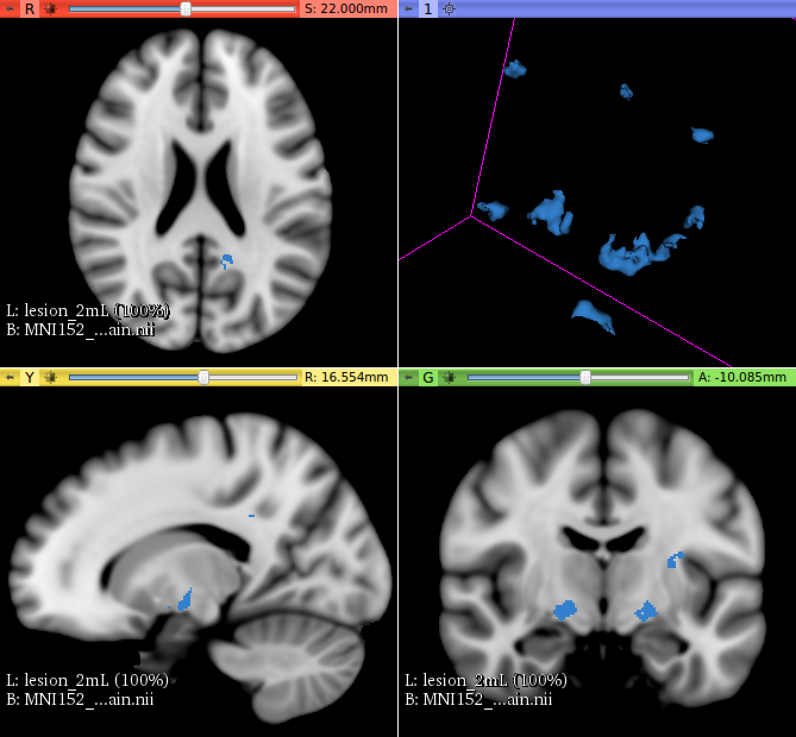
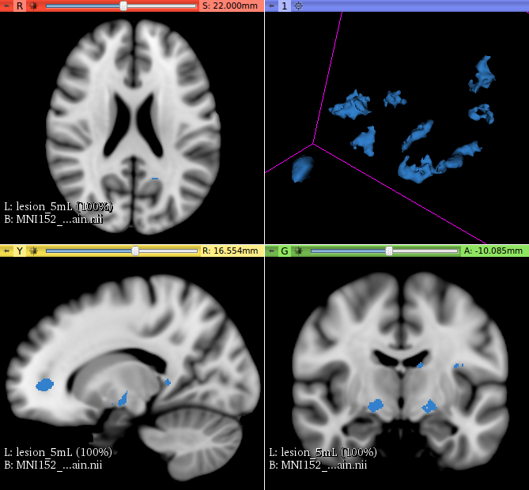
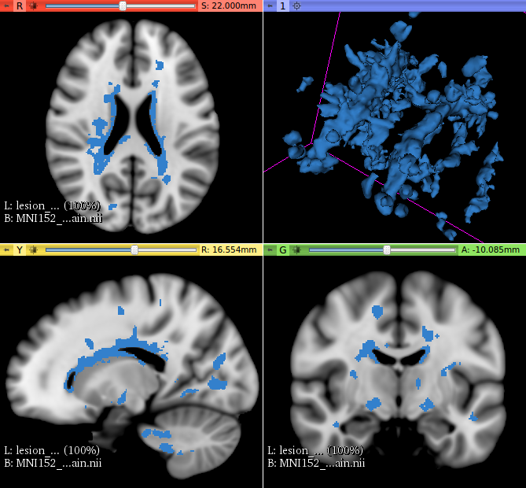
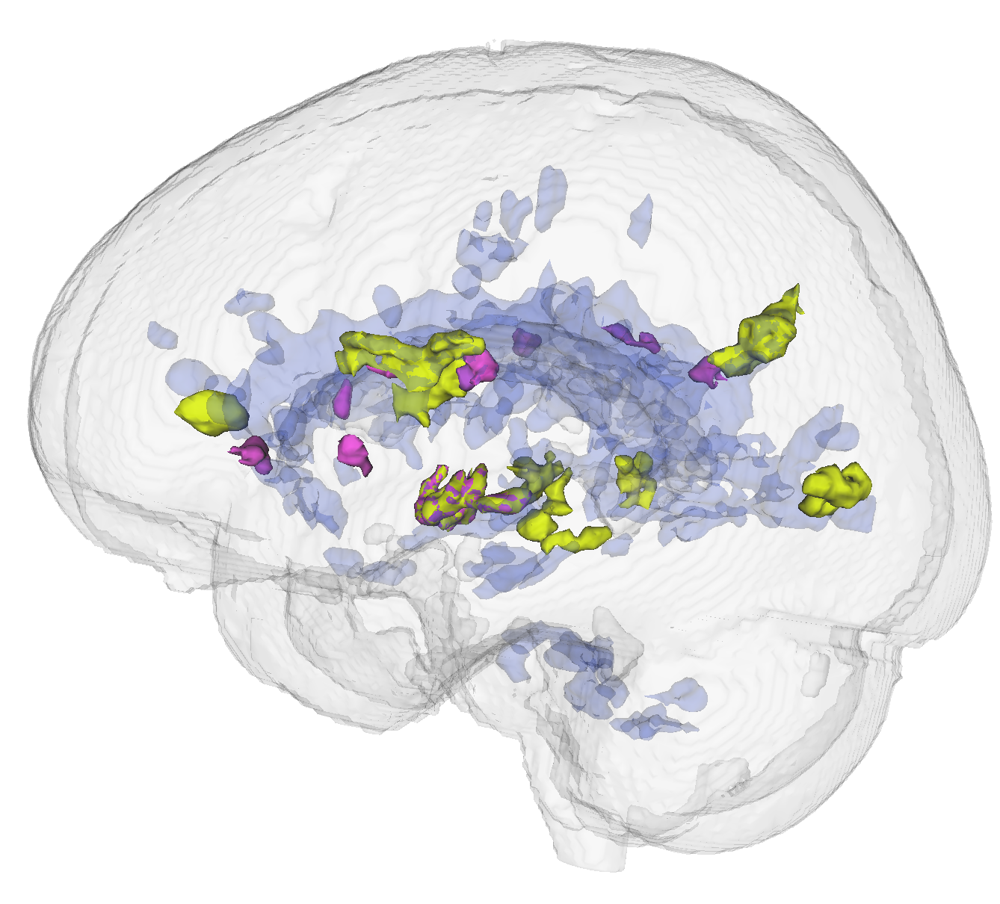
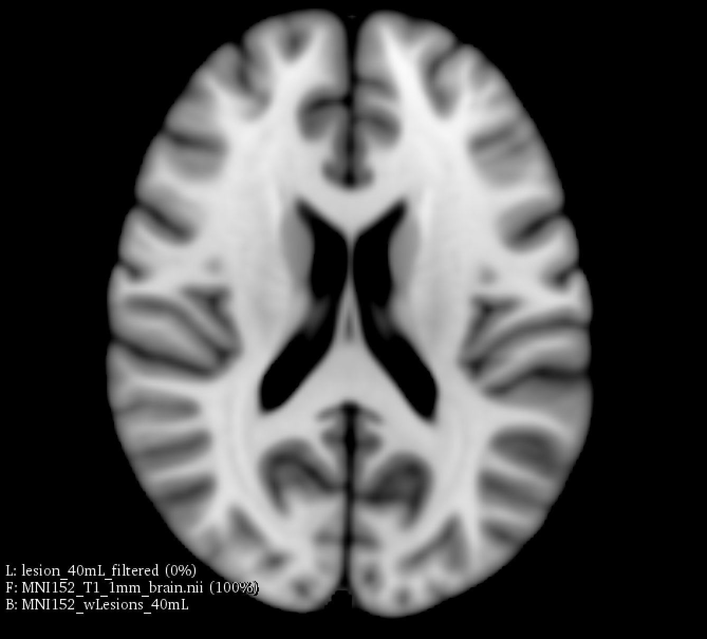
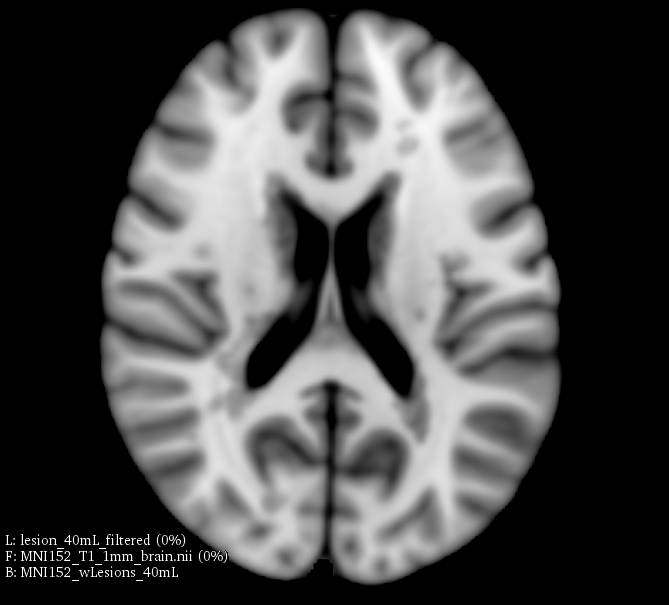
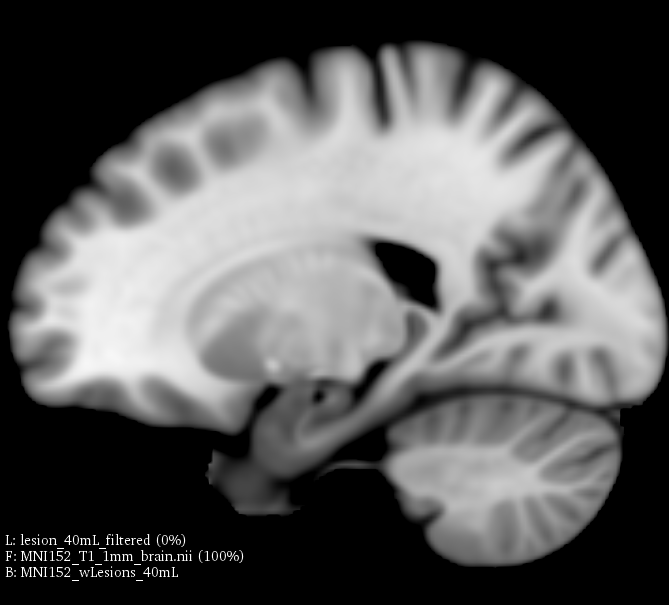
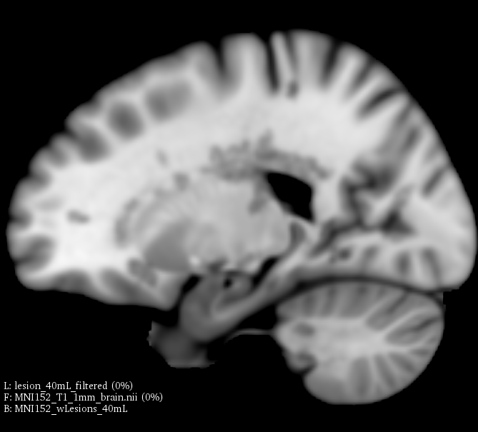

# Brain Lesion Simulator
{ width="250" .center}

Welcome to the Brain Lesion Simulator Slicer Extension!

This extension offer a set of tools for brain lesion simulation, based on MRI images. At moment, the module MS Lesion Simulator is available, where it can simulates both baseline scan lesion volumes (given a lesion load) and longitudinal image simulations. In summary, a statistical lesion database is generated based on a set of manual lesion mark-ups, being non-linearly registered to MNI152 space (isotropic 1mm of voxel resolution), and a local contrast ratio is applied on each image modality provided by the user. Using a small set of parameters (lesion load, lesion homogeneity, lesion intensity indenpendence and lesion variability), it is possible to generate a broad range of MS lesions patterns in multimodal MRI imaging techniques (at moment, T1, T2, T2-FLAIR, PD, DTI-FA and DTI-ADC images are provided). For more details about this project, please see the original paper[^1].

[^1]: Antonio Carlos da S Senra Filho, Fabrício Henrique Simozo, Antonio Carlos dos Santos and Luiz Otavio Murta Junior, "Multiple Sclerosis multimodal lesion simulation tool (MS-MIST)". 2019 Biomed. Phys. Eng. Express. [DOI:10.1088/2057-1976/ab08fc](https://doi.org/10.1088/2057-1976/ab08fc)

## Use Cases

Most frequently used for these scenarios:

- **Use Case 1: **Simulate different anatomical/clinical MS lesions patterns on healthy individuals MRI images

    - In the baseline scan approach, it is offered a simulation procedure where a determined lesion load is reconstructed using a subject specific anatomical features, resulting in a realistic MS lesion load simulation.

- **Use Case 2:** Simulate longitudinal MS lesion progression on clinical healthy individuals MRI images

    - Another important issue in Multiple Sclerosis diagnosis is the lesion progression, where drive the therapeutic strategy by the health professionals. In this case, an automatic segmentation approach could be optimally adjusted for the time progression presented in a exam series.

MS lesion simulation with 2mL lesion load

MS lesion simulation with 5mL lesion load

MS lesion simulation with 40mL lesion load

A 3D reconstruction of 2mL, 5mL and 40mL lesion loads showing that each lesion pattern is independent of each other

## Modules

### MS Lesion Simulator

)

This module offers a simulation toolkit for baseline Multiple Sclerosis (MS) brain lesion volumes (given a lesion load) and longitudinal image simulations, respectively. In summary, a statistical lesion database is generated based on a set of manual lesion mark-ups, being non-linearly registered to MNI152 space (isotropic 1mm of voxel resolution). Using a small set of parameters (lesion load, lesion homogeneity, lesion intensity independence and lesion variability), it is possible to generate a broad range of MS lesions patterns in multimodal MRI imaging techniques (at moment, T1, T2, T2-FLAIR, PD, DTI-FA and DTI-ADC images are provided).

#### Painel and Parameters

**Input Parameters:**

- T1 Volume

    - A T1 weighted MRI image from a healthy individual.

- T2 Volume
    
    - A T2 weighted MRI image from a healthy individual.

- T2-FLAIR Volume
    
    - A T2-FLAIR weighted MRI image from a healthy individual.

- PD Volume

    - A PD weighted MRI image from a healthy individual.

- DTI-FA Map
    
    - A DTI-FA map from a healthy individual.

- DTI-ADC Map
    
    - A DTI-ADC map from a healthy individual.

- Output Lesion Label
    
    - Pick the output lesion label.

- Return output data in the original space
    
    - Choose if you want to transform the final images to its original space. If not, all the input images will be in T1 space. NOTE: This choice only takes effect on the baseline MS lesion simulation, i.e. the longitudinal lesion simulation (if checked) will always return the data using the T1 space.

- Is brain extracted?
    
    - Is the input data already brain extracted? This information is only used for MNI152 template, where it helps to the registration process

**MS Lesion Simulation Parameters:**

- Lesion Load
    
    - Set the desired lesion load to be used for MS lesion generation.

- Sigma
    
    - Choose the Gaussian variance to be applied in the final lesion map. The scale is given in mm.

- Lesion Homogeneity
    
    - Choose the lesion homogeneity present in the lesion simulation. Lower values give a more heterogenous lesion contrast. This parameter is related to a Gaussian variance given in mm.

- Lesion Variability
- 
    - Choose the lesion independent variability level that represents how distinct is each non-connected lesion regarding the voxel intensity gray level. This measure simulates the independent progression for each lesion, where a higher value indicates higher variability among lesions. The parameter is modulated by the normal standard deviation depending of the image type inserted

**MS Longitudinal Lesion Simulation Parameters:**

- Simulate Longitudinal Exams?

    - Simulate an additional longitudinal sequence (given the same input data)? If checked, the MS Lesion Simulator tool will recreate a sequence of exams with longitudinal MS lesion pattern.

- Follow-ups
    
    - Set the desired number of follow-up acquisitions that will be simulated.

- Changing Contrast Balance
    
    - Set the percentage of lesions that will change its original signal state along with the follow-ups.

- Output Follow-Up
    
    - Output folder where follow-up image files will be saved.

**Advanced Parameters:**

- White Matter Threshold
    
    - Set the White Matter threshold used to refine the simulated lesion map. The simulation suppose that the MS lesions belongs only in the White Matter space. This variable is related to the voxel intensity and the White Matter probability distribution (standard deviation).

- Percentage Of Samples
    
    - Percentage of voxel used in registration.

- BSpline Grid
    
    - Set the BSpline grid for non-linear structural adjustments.

- Initiation Method
    
    - Initialization method used for the MNI152 registration.

T1 weighted MRI brain in axial orientation (provided by the ICBM-MNI152 non linear brain template)

The same MNI152 template with 40mL lesion load simulated lesions (axial orientation)

T1 weighted MRI brain in sagittal orientation (provided by the ICBM-MNI152 non linear brain template)

The same MNI152 template with 40mL lesion load simulated lesions (sagittal orientation)

## Cite this tool

We hope that the `Brain Lesion Simulator` can be helpful for your applications. If possible, recall to cite at least one of the following publications:

* Senra Filho, A. C. da S., Simozo, F. H., dos Santos, A. C., & Junior, L. O. M. (2019). Multiple Sclerosis multimodal lesion simulation tool (MS-MIST). Biomedical Physics & Engineering Express, 5(3), 035003.  [DOI: 10.1088/2057-1976/ab08fc](https://doi.org/10.1088/2057-1976/ab08fc)

## License

This project is under Apache version 2.0 license and following details are given at the [LICENSE](https://github.com/CSIM-Toolkits/SlicerDiffusionComplexityMap/blob/main/LICENSE) file in the project repository.